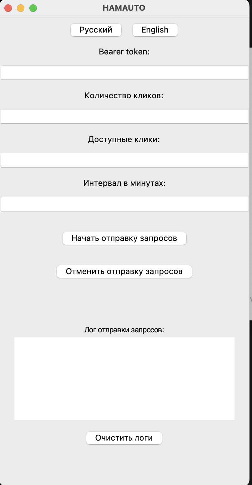

Надоело тапать хомяка? Тогда эта программа поможет тебе!

Представляю вашему вниманимаю Hamauto. Это софт для Hamster Kombat, который будет отправлять запросы на сервер хамстера с "тапами". Никаких автокликеров, лишь разовая настройка и дальше софт все сделает за вас.

Hamauto находится на стадии тестирования и доработки, возможны баги или неисправности.

Как пользоваться?
1) Для начала, качаем версию для вашей операционной системы (на данный момент есть только Windows/MacOS)

2)
Windows: 
Запускаем исполняемый файл main.exe

MacOS:
Запускаем исполняемый файл main.app. Если файл не запускается, надо открывать терминал в папке с проектом и выполнить команду "open MyApp.app"

3) У вас должно открыться вот такое окно: 

