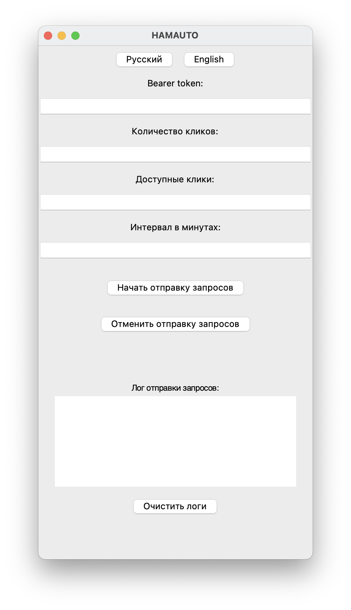
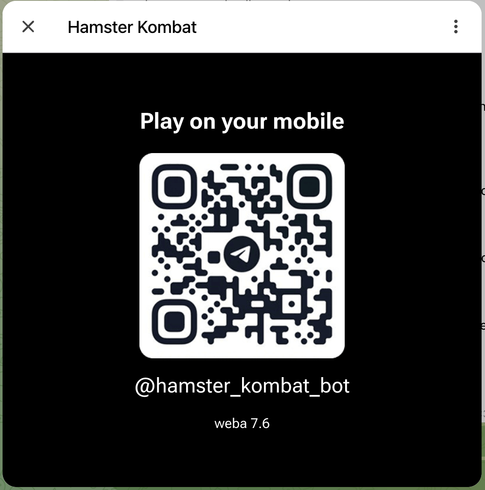
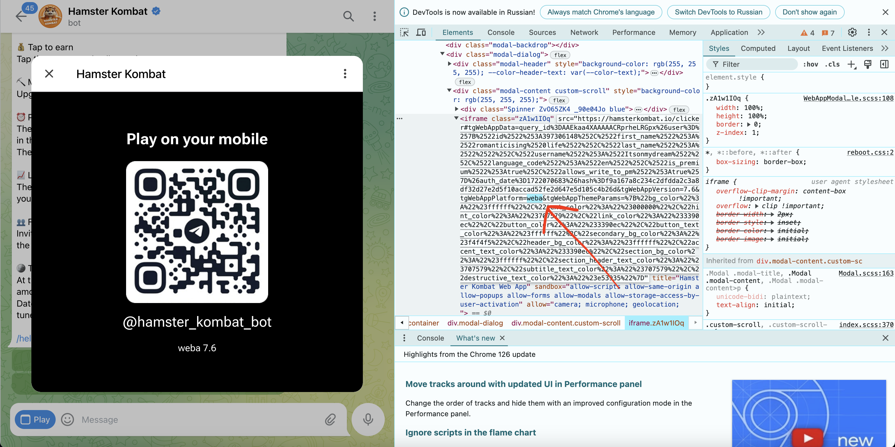

Надоело тапать хомяка? Тогда эта программа поможет тебе!

Представляю вашему вниманимаю Hamauto. Это софт для Hamster Kombat, который будет отправлять запросы на сервер хамстера с "тапами". Никаких автокликеров, лишь разовая настройка и дальше софт все сделает за вас.

Hamauto находится на стадии тестирования и доработки, возможны баги или неисправности. Я не несу ответственности если ваш аккаунт будет забанен.

Как пользоваться?
1) Для начала, качаем версию для вашей операционной системы (на данный момент есть только Windows/MacOS)

2)
Windows: 
Запускаем исполняемый файл main.exe

MacOS:
Запускаем исполняемый файл main.app. Если файл не запускается, надо открывать терминал в папке с проектом и выполнить команду "open MyApp.app"

3) У вас должно открыться вот такое окно: 

4) Далее, нам нужно зайти в Hamster Kombar через Web Telegram, желательно через браузер Google Chrome, так как нам будут нужны devtools.

Когда вы нажмете в боте хамстера "Play in 1 click", то получите вот такое окно 

Теперь нам нужно открыть devtools в Google, вы можете пользоваться и другими, но я буду показывать на примере Google Chrome.

Нам нужно нажать кнопку выбора элемента и нажать по QR коду или любом другом webview элементе, далее нужно пролистать выше до тэга "iframe" и найти в нем вот эту строку

Исправляем эту строчку на "android" и приложение запускается.

5) Теперь нам нужно открыть в devtools вкладку "Network", выбрать "Fetch/XHR" и очистить все текущие запросы (синяя стрелка на скриншоте)

Делаем 1 клик по хомяку и ждем несколько секунд, должен появится запрос, на который указывается красная стрелка

Нажимаем на этот запрос и выбираем вкладку "Headers", здесь ищем header "Authroization" и копируем отсюда токен без "Bearer"

6) Возвращаемся в приложение и указываем токен в самом первом поле "Bearer token"

Далее в поле "Количество кликов" мы указываем максимально допуступное количество вам кликов, как вы видите, на моих скриншотах это 2000, у вас может быть другое число.

В поле "Доступные клики" мы указываем сколько остается кликов, если у меня маскимум доступно 2000 кликов и я 2000 "использую", то в поле "Доступные клики" напишем 0, главное чтобы эти данные совпадали с реальностью, в ином случае вы можете ПОЛУЧАТЬ БАН НА СЕРВЕРЕ! Я не проверял это, и вам не советую

В поле "Интервал в минутах" мы указываем интервал в минутах между отправкой запроса на сервер хамстера, в идеале вам выкликать все ваши доступные клики и засечь время от 0 до максимального количества и прибавить к нему минуту, лучше брать больше времени. Этот параметр отвечает за интервал между запросами, будьте также внимательны, это тоже важный параметр, желательно иметь минимальное расхождение в данных. 

Имейте ввиду, иногда вы будете переходить на новый уровень и у вас могут измениться вводные данные (например максимально доступное количество кликов), будьте внимательны и в таком случае перезапустите бота, в будущем я постараюсь это автоматизировать.

DL
[Скачать файл](release/hamauto_macos)
<a href="release/hamauto_macos.zip" download>MacOS</a>
<a href="release/hamauto_windows.zip" download>Windows</a>