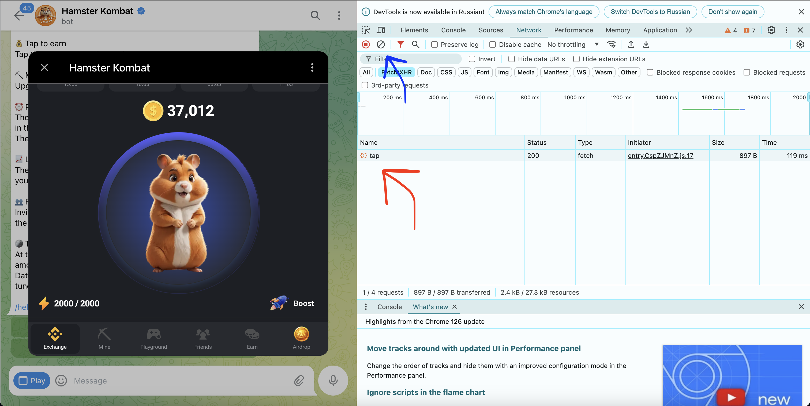
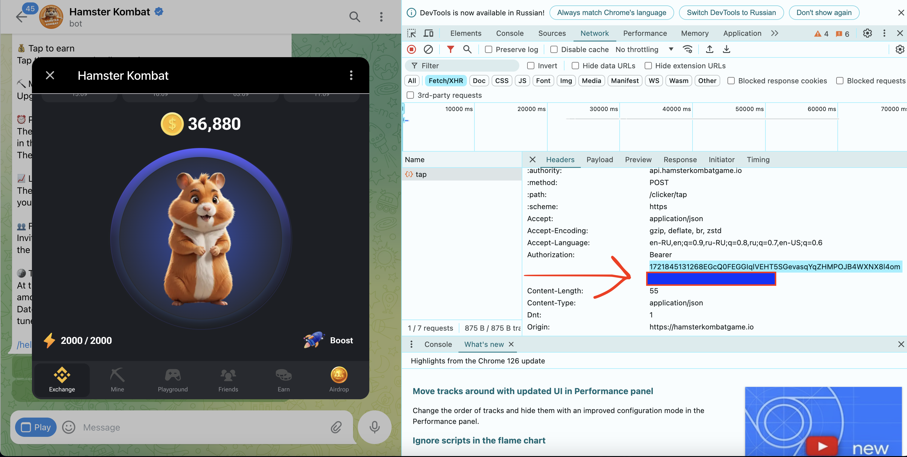

# Hamauto - Autobot for Hamster Kombat

### Download / Скачать

- [MacOS](https://github.com/Jelezik/hamauto/raw/main/release/hamauto_macos.zip)
- [Windows](https://github.com/Jelezik/hamauto/raw/main/release/hamauto_windows.zip)

#### Documentation / Документация

[English](#english) | [Русский](#русский)

## English

Tired of tapping the hamster? Then this program will help you!

Introducing Hamauto. This software for Hamster Kombat will send requests to the hamster server with "taps". No auto-clickers, just a one-time setup, and the software will do everything for you.

**Hamauto is in the testing and development stage, bugs or malfunctions are possible. I am not responsible if your account gets banned.**

### How to use?

1. **First, download the version for your operating system (currently only available for Windows/MacOS)**

2. **Launch the application:**
   - **Windows:** Run the executable file `main.exe`.
   - **MacOS:** Run the executable file `main.app`. If the file does not start, open the terminal in the project folder and execute the command `open MyApp.app`.

3. **After launching, you should see the following window:**

   

4. **Next, log into Hamster Kombar through Web Telegram, preferably through the Google Chrome browser, as we will need devtools.**

   When you click "Play in 1 click" in the hamster bot, you will see the following window:

   

   Now open devtools in Google Chrome. You can use other tools, but I will show it using Google Chrome.

5. **In devtools, click the element selection button and click on the QR code or any other webview element. Scroll up to the `iframe` tag and find the following line:**

   

   Change this line to "android", and the application will start.

6. **Now open the "Network" tab in devtools, select "Fetch/XHR" and clear all current requests (blue arrow on the screenshot).**

   Make one click on the hamster and wait a few seconds, a request should appear, indicated by the red arrow:

   

   Click on this request and select the "Headers" tab. Here, find the "Authorization" header and copy the token without "Bearer":

   

7. **Return to the application and enter the token in the first field "Bearer token".**

   - In the "Number of clicks" field, enter the maximum allowable number of clicks. In my screenshots, it's 2000, but you might have a different number.
   - In the "Available clicks" field, enter how many clicks are left. If my maximum available is 2000 clicks and I use 2000, then in the "Available clicks" field, write 0. Make sure these data match reality, otherwise you might get banned on the server! I haven't tested this, and I don't recommend it.
   - In the "Interval in minutes" field, enter the interval in minutes between sending requests to the hamster server. Ideally, you should click all your available clicks, measure the time from 0 to the maximum number, and add a minute to it. It's better to take more time. This parameter determines the interval between requests, be careful, this is also an important parameter, it is desirable to have minimal deviation in the data.

**Keep in mind, sometimes you will level up, and your input data might change (e.g., maximum available clicks). Be attentive and restart the bot in such cases. In the future, I will try to automate this.**

## Русский

Устали тапать хомяка? Тогда эта программа поможет вам!

Представляю вашему вниманию Hamauto. Это софт для Hamster Kombat, который будет отправлять запросы на сервер хомяка с "тапами". Никаких автокликеров, лишь разовая настройка, и дальше софт все сделает за вас.

**Hamauto находится на стадии тестирования и доработки, возможны баги или неисправности. Я не несу ответственности, если ваш аккаунт будет забанен.**

### Как пользоваться?

1. **Для начала, скачайте версию для вашей операционной системы (на данный момент есть только Windows/MacOS)**

2. **Запуск приложения:**
   - **Windows:** Запустите исполняемый файл `main.exe`.
      - **MacOS:** Запустите исполняемый файл `main.app`. Если файл не запускается, откройте терминал в папке с проектом и выполните команду `open MyApp.app`.

3. **После запуска у вас должно открыться следующее окно:**

   

4. **Далее, зайдите в Hamster Kombar через Web Telegram, желательно через браузер Google Chrome, так как нам будут нужны devtools.**

   Когда вы нажмете в боте хомяка "Play in 1 click", вы получите следующее окно:

   

   Теперь откройте devtools в Google Chrome. Вы можете пользоваться и другими инструментами, но я буду показывать на примере Google Chrome.

5. **В devtools нажмите кнопку выбора элемента и нажмите по QR коду или любому другому webview элементу. Пролистайте выше до тэга `iframe` и найдите в нем следующую строку:**

   

   Исправьте эту строчку на "android", и приложение запустится.

6. **Теперь откройте в devtools вкладку "Network", выберите "Fetch/XHR" и очистите все текущие запросы (синяя стрелка на скриншоте).**

   Сделайте 1 клик по хомяку и подождите несколько секунд, должен появиться запрос, на который указывает красная стрелка:

   

   Нажмите на этот запрос и выберите вкладку "Headers". Здесь найдите header "Authorization" и скопируйте оттуда токен без "Bearer":

   

7. **Возвращаемся в приложение и указываем токен в самом первом поле "Bearer token".**

   - В поле "Количество кликов" укажите максимально допустимое количество кликов. На моих скриншотах это 2000, у вас может быть другое число.
   - В поле "Доступные клики" укажите сколько осталось кликов. Если у меня максимум доступно 2000 кликов и я использую все 2000, то в поле "Доступные клики" напишем 0. Главное чтобы эти данные совпадали с реальностью, иначе вы можете получить бан на сервере! Я не проверял это, и вам не советую.
   - В поле "Интервал в минутах" укажите интервал в минутах между отправкой запроса на сервер хомяка. В идеале вам нужно кликнуть все ваши доступные клики, засечь время от 0 до максимального количества и добавить к нему минуту. Лучше брать больше времени. Этот параметр отвечает за интервал между запросами, будьте внимательны, это важный параметр, желательно иметь минимальное расхождение в данных.

**Имейте ввиду, иногда вы будете переходить на новый уровень и у вас могут измениться вводные данные (например, максимально доступное количество кликов). Будьте внимательны и в таком случае перезапустите бота. В будущем я постараюсь это автоматизировать.**